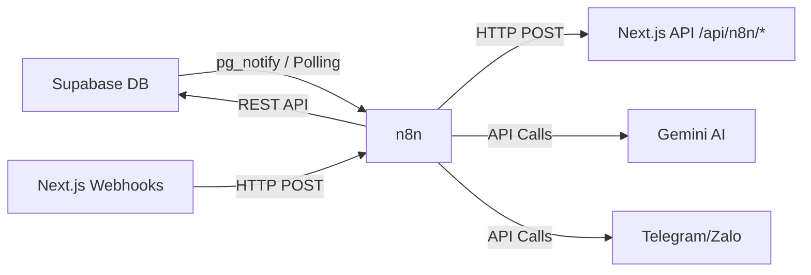

# PC Master Builder - n8n Workflow Automation

## Architecture



## Quick Start

### 1. Deploy n8n (Docker)

```bash
cd n8n
cp .env.n8n.example .env
# Edit .env with your settings
docker-compose up -d
```

### 2. Configure Supabase

Run the SQL migration file to create database functions:
```bash
# In Supabase SQL Editor, run:
database/20260622_n8n_integration.sql
```

### 3. Import Workflows

1. Open n8n at http://localhost:5678
2. Go to Workflows > Import from File
3. Import each JSON file from `workflows/` folder
4. Configure credentials (Supabase, Gemini, Telegram, Zalo)
5. Activate workflows

### 4. Set Vercel Environment Variables

```
N8N_WEBHOOK_SECRET=your-secret-key
N8N_WEBHOOK_URL=https://your-n8n-server.com/webhook
```

## Webhook API Reference

All webhooks require `Authorization: Bearer <N8N_WEBHOOK_SECRET>` header.

### POST /api/n8n/webhook/certificate
Generate certificate for completed course.
```json
{ "studentId": "uuid", "pathId": "uuid" }
```

### POST /api/n8n/webhook/alert
Send academic alerts.
```json
{ "studentId": "uuid", "reason": "string", "alertType": "low_score" }
```

### POST /api/n8n/webhook/xp
Award XP to user.
```json
{ "userId": "uuid", "amount": 100, "reason": "certificate_completed" }
```

### POST /api/n8n/webhook/notification
Bulk create notifications.
```json
{ "recipients": ["uuid1","uuid2"], "title": "...", "message": "..." }
```

### POST /api/n8n/webhook/lesson-content
Generate content with Gemini AI.
```json
{ "topic": "CPU", "difficulty": "trung binh", "questionCount": 5 }
```

## Database Functions (created by migration)

| Function | Purpose | n8n Trigger |
|---|---|---|
| `check_completed_paths()` | Find students ready for certificate | Cron (30min) |
| `get_students_low_performance()` | Find at-risk students | Cron (1h) |
| `get_weekly_stats_summary()` | Weekly analytics | Cron (Mon 8AM) |
| `get_student_weekly_summary(UUID)` | Per-student weekly report | Cron (Mon 8AM) |
| `add_xp(UUID, INT)` | Safely add XP and update level | Any workflow |

## n8n Event Queue

When lessons are completed or quizzes submitted, the database automatically inserts events into the `n8n_events` table. n8n can poll this table to process events.

```sql
-- n8n polls every 5 minutes:
SELECT * FROM get_n8n_pending_events();

-- After processing, mark as done:
SELECT mark_event_processed('event-uuid', 'completed');
```

## Workflow Descriptions

| # | Workflow | Trigger | Purpose |
|---|---|---|---|
| 1 | Auto Certificate | Cron 30min | Auto-issue certificate when all lessons done |
| 2 | Student Alert | Cron 1h | Detect low performance and alert parents/teachers |
| 3 | Generate Content | Webhook | Teacher triggers AI to create quiz questions |
| 4 | Weekly Report | Cron Mon 8AM | Send progress reports to all stakeholders |
| 5 | Zalo/Telegram | Webhook | Forward notifications to Zalo/Telegram |
| 6 | Daily Quest | Cron 6AM | Generate daily quests and remind streaks |
